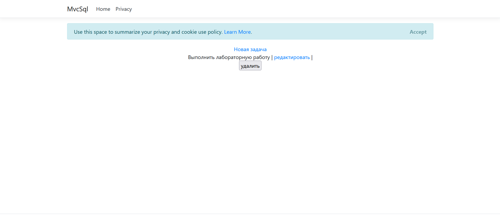
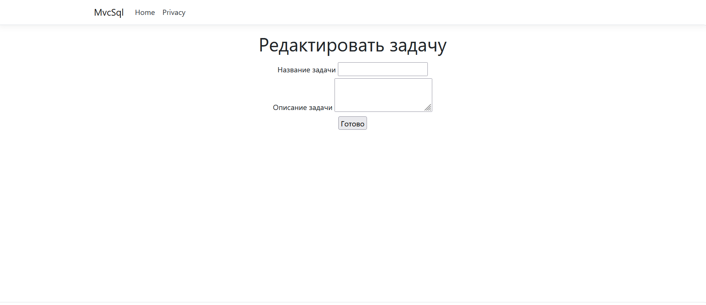

# Приложение  ASP.NET с взаимодействием с базой данных SQL.

**ТЗ на лабораторные работы:**
1) Создание ASP.NET, написание взаимодействия с базой
2) Создание представлений данных по работе с базой
3) Обработка данных с базы данных написание сервисов по обработке данных с базы данных

## Описание работы

